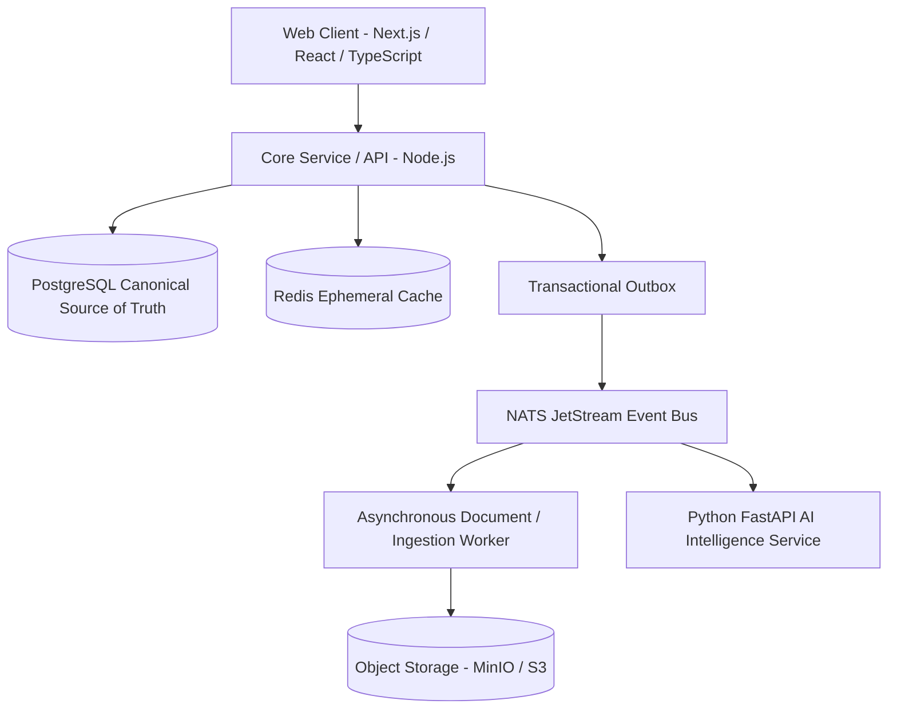

# FINORA — Household Financial Intelligence Platform

> **Finora** is an autonomous AI-native household financial intelligence platform that transforms fragmented family financial data—spreadsheets, bank exports, credit-card statements, bills, receipts, recurring payments, debts, goals, and financial documents—into a unified double-entry ledger and intelligent decision system. Designed around Brazilian household financial workflows (**pt-BR** / **BRL**), Finora helps families understand not only where their money went, but where it is going.

---

## 🌟 Primary Objective

The primary goal of Finora is to replace complex, fragmented Excel budgeting spreadsheets with a modern, high-precision financial operating system.

Unlike basic CRUD expense trackers, Finora enforces strict financial accounting rules:
- **Transfers are not expenses**: Moving money between accounts does not produce spending.
- **Credit card double-counting protection**: Card purchases create liabilities; card bill payments settle liabilities without double-counting expenses.
- **Dual-semantic installment tracking**: Handles economic commitment (full purchase price) alongside cash-flow schedule (monthly *parcelas*).
- **No floating-point money**: Financial amounts are stored in integer minor units (centavos).

---

## 🏗 System Architecture

Finora is structured as a **Modular Monolith First** with asynchronous background processing via NATS JetStream and a Transactional Event Outbox.



---

## 🛠 Technology Stack

- **Web Frontend**: Next.js 15 (App Router), React 19, TypeScript, Tailwind CSS, Lucide Icons, shadcn/ui accessible primitives.
- **Backend Core**: Node.js / TypeScript (with Go worker support option), RESTful API, PostgreSQL database.
- **AI & Data Intelligence**: Python 3.13, FastAPI, Pydantic structured outputs, Provider abstraction (`MockAIProvider`, OpenAI, Gemini, Anthropic).
- **Database**: PostgreSQL 16 with raw SQL migrations.
- **Messaging & Event Bus**: NATS JetStream + Transactional Outbox Pattern.
- **Caching & Ephemeral State**: Redis 7.
- **Object Storage**: MinIO (local development) / AWS S3 (production).
- **Development Operating System**: Built using **GSD Core (Get Shit Done)** specification-driven development workflows (`.agents/`).

---

## 🚀 Quick Start & Local Setup

### Prerequisites
- Node.js `v22+` & `npm` / `pnpm`
- Docker & Docker Compose

### 1. Clone & Set Up Environment
```bash
git clone https://github.com/MauricioTAzevedo/finora.git
cd finora
cp .env.example .env
```

### 2. Launch Local Infrastructure
```bash
# Starts PostgreSQL, NATS JetStream, Redis, and MinIO
docker compose up -d
```

### 3. Install Dependencies & Run Development Server
```bash
npm install
npm run dev
```
Open [http://localhost:3000](http://localhost:3000) in your browser.

---

## 🧪 Testing Strategy

Finora includes automated unit, integration, invariant, and security isolation tests:

```bash
# Run all tests
npm test
```

Key invariant test suites:
- `test(ledger)`: Double-entry balanced posting (`Sum(Debits) == Sum(Credits)`).
- `test(invariants)`: Transfer non-expense & credit card settlement verification.
- `test(security)`: Multi-tenant cross-household authorization isolation checks.

---

## 📂 Repository Structure

```text
finora/
├── apps/
│   └── web/              # Next.js frontend web application
├── services/
│   ├── api/              # Core backend REST API & domain services
│   ├── worker/           # Background document & ingestion worker
│   └── ai/               # Python AI intelligence & query service
├── packages/
│   └── contracts/        # Shared TypeScript schemas, API contracts, types
├── database/
│   ├── migrations/       # SQL migrations for PostgreSQL
│   └── seeds/            # Synthetic Brazilian household test data
├── docs/
│   ├── product/          # Product vision & user flows
│   ├── architecture/     # System architecture overview & data models
│   ├── adr/              # Architecture Decision Records (ADRs)
│   └── security/         # Threat model & privacy safeguards
├── .planning/            # GSD Core PRD, Roadmap, & Phase Plans
├── docker-compose.yml    # Infrastructure definitions
├── package.json          # Workspace configuration
├── LICENSE               # MIT License
└── SECURITY.md           # Security policy & vulnerability reporting
```

---

## 🔒 Security Posture & Privacy

- **Strict Multi-Tenant Isolation**: All operations are authorized at the household boundary.
- **Untrusted File Ingestion**: Excel, CSV, OFX, and PDF uploads are sanitized; no macro or formula execution.
- **Prompt Injection Defense**: Untrusted text is strictly isolated in AI prompts.
- **Offline / Local AI Support**: Full functional execution with `AI_PROVIDER=mock` without transmitting financial data externally.

---

## 📜 License

[MIT License](LICENSE) © 2026 Maurício Azevedo & Finora Contributors.
