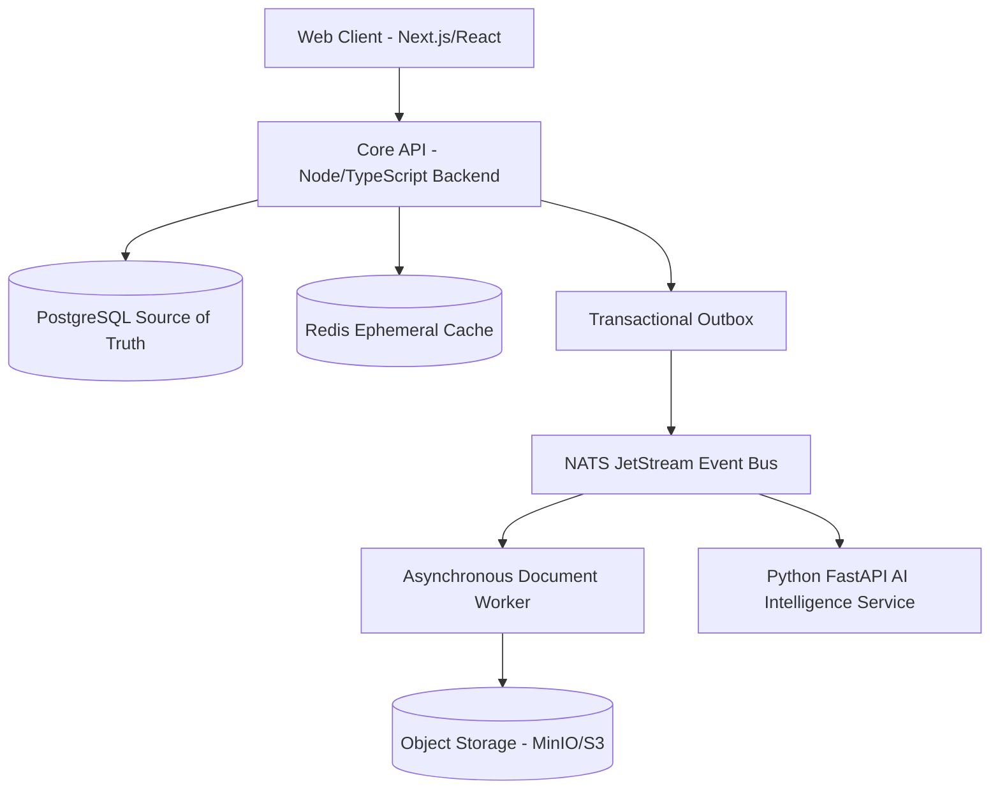

# Finora — System Overview & Architecture

## System Architecture

Finora is designed as a **Modular Monolith First** with decoupled worker services communicating asynchronously via NATS JetStream and a Transactional Event Outbox.

## Bounded Contexts / Modules

1. **Identity & Households**: User authentication, session management, multi-user household scope, roles, permissions.
2. **Accounts & Credit Cards**: Bank accounts, credit card statement management, installment tracking, balance tracking.
3. **Double-Entry Ledger & Transactions**: Core double-entry engine, postings, manual & imported transactions, split payments.
4. **Import & Ingestion**: Excel (XLSX), CSV, OFX, PDF document parsing, mapping inference, staging, duplicate detection, batch ingestion.
5. **Reconciliation & Normalization**: Merchant fuzzy matching, transaction reconciliation scoring, alias rules.
6. **Subscriptions & Anomaly Detection**: Statistical anomaly analysis, subscription detection, price change alerts.
7. **Forecast & Scenario Engine**: Deterministic cash flow projections, digital twin modeling, what-if simulations.
8. **AI Intelligence**: Tool-calling agent, natural language search query DSL generator, evidence-backed financial briefs.
9. **Automation & Notifications**: Rule engine DSL, threshold alerts, in-app notifications.
10. **Audit & Observability**: Immutable audit trail, OpenTelemetry tracing, structured JSON logs.

## Architectural Decision Records (ADRs)
- [ADR-001: Modular Monolith Architecture](../adr/ADR-001-modular-monolith-architecture.md)
- [ADR-002: PostgreSQL as Source of Truth](../adr/ADR-002-postgresql-as-source-of-truth.md)
- [ADR-003: Integer Minor Units for Money](../adr/ADR-003-integer-minor-units-for-money.md)
- [ADR-004: Double-Entry Ledger](../adr/ADR-004-double-entry-ledger.md)
- [ADR-005: Event Outbox Pattern](../adr/ADR-005-event-outbox-pattern.md)
- [ADR-006: NATS JetStream Event Bus](../adr/ADR-006-nats-jetstream-event-bus.md)
- [ADR-007: AI Provider Abstraction](../adr/ADR-007-ai-provider-abstraction.md)
